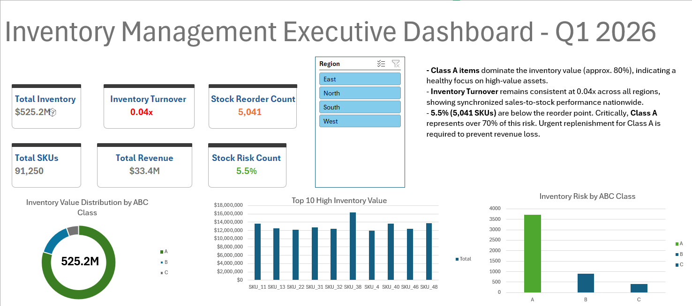

# Supply-Chain-Inventory-Analysis-Dashboard
Inventory Management Executive Dashboard (Q1-2026) | End-to-end supply chain analysis using SQL (BigQuery) and Excel. Featuring ABC Analysis, KPI tracking, and Stock-out Risk assessment for 91K+ SKUs.

## Project Overview
This project focuses on analyzing and visualizing inventory data for over **91,000 SKUs** nationwide. The objective is to enable executives to quickly grasp capital flow status, operational performance, and stock-out risks, thereby facilitating timely procurement decisions.

## Tech Stack & Skills
* **SQL (Google BigQuery):** Process raw data, perform ABC classification, and calculate Inventory Turnover and Stock Status.
* **Microsoft Excel:** Build a dynamic dashboard using Pivot Tables, the `GETPIVOTDATA` function, Slicers, and Advanced Charting.
* **Supply Chain Knowledge:** ABC Analysis, Reorder Point, Inventory Turnover Ratio.

## Key Features
* **6 Interactive KPI Cards:** Monitor total inventory, revenue, inventory turnover rates, and the quantity of items requiring urgent replenishment.
* **ABC Classification:** Classify goods by value to optimize capital flow management (Group A accounts for ~80% of the value).
* **Region-based Slicer:** Enables quick data filtering by four regions: East, North, South, and West..
* **Risk Breakdown:** Detailed Inventory Risk Analysis Chart by ABC Group

## Key Business Findings
1. **Capital Concentration:** **Class A** items account for the largest share in terms of value (80%), validating the strategy of focusing on high-value assets.
2. **Operational Stability:** The **Inventory Turnover** ratio remains stable at 0.04x nationwide, indicating operational consistency across regions.
3. **Critical Alert:** Currently, **5.5% (5,041 SKUs)** are below their reorder points. Notably, Group A accounts for over 70% of this list, requiring urgent replenishment prioritization to prevent revenue loss.

## Project Structure
* `/dashboard`: The completed Excel file (.xlsx).
* `/sql`: SQL statements used for data processing.
* `/images`: Dashboard screenshots.
